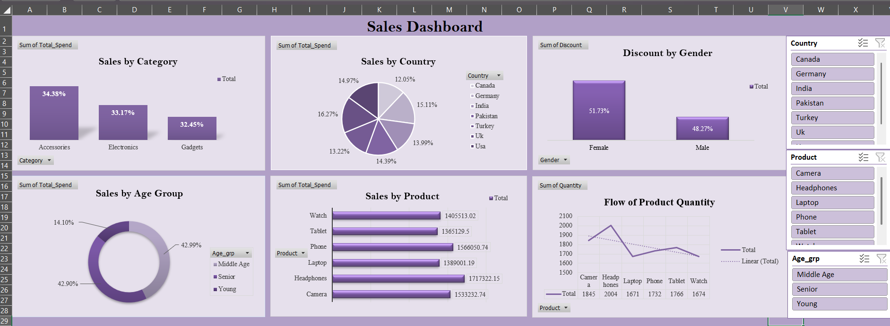

# 🛍️ Retail Sales Performance Analysis (Excel Dashboard)
Interactive Excel dashboard analyzing retail sales performance with KPIs, trends, and insights.  Retail sales data analysis using Excel (Pivot Tables, Power Query, Charts, Dashboard).  Excel dashboard project showcasing data cleaning, visualization, and KPI reporting.

## 📌 Project Overview
This project is an **interactive Excel dashboard** that analyzes retail sales performance and provides actionable insights across different dimensions.  
It was created as a **learning exercise** while practicing Excel data analytics.

The dashboard enables quick insights into:
- Sales by **Category, Country, and Product**
- Sales distribution by **Age Group and Gender**
- **Discount patterns** across demographics
- **Product quantity flow** and demand trends

---

## 🎯 Objectives
- Clean and preprocess raw sales data using Excel tools.  
- Create an **interactive dashboard** with slicers and charts.  
- Analyze **customer behavior** and **sales trends**.  
- Build a professional project for resume and portfolio purposes.  

---

## 🛠 Tools & Techniques Used
- **Microsoft Excel**
  - Pivot Tables  
  - Power Query  
  - Data Cleaning & Transformation  
  - Charts & Visualizations  
  - Slicers for interactivity  

---

## 📊 Dashboard Preview

🔗 [Download the Excel Dashboard](Retail_Sales_Dashboard.xlsx)

---

## 📈 Key Insights
- Certain **categories and countries** contribute the most to revenue.  
- Discounts impact **male and female customers** differently.  
- **Young age groups** drive higher product demand.  
- Seasonal/product trends can be observed in **quantity flow charts**.  

---

## 🙌 Credits & Acknowledgments
This project was created as a **learning exercise** based on the YouTube tutorial:  
[Excel Data Analysis Project for Beginners | Full Excel Tutorial with Interactive Dashboard](https://youtu.be/Gi0wCy2byY8)  

Many thanks to the content creator for their guidance.  

---

## 📜 License
This project is for **learning and showcasing purposes only**.  
No license has been applied, so reuse/modification is not permitted.  

---

👩‍💻 **Created by:**  
**C Arul Francisca** 
**Fresher| Aspiring Data Analyst**  
